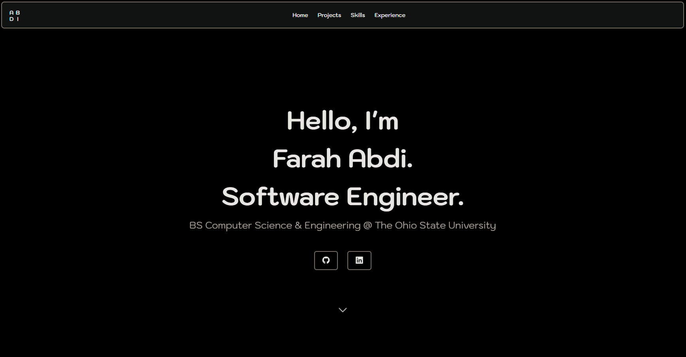

## About The Project
Welcome to my personal portfolio.

This repository contains the source code for my portfolio website. The site highlights my software engineering, data science, and machine learning projects, technical skills, and professional and leadership experience.



### Built With
- HTML5
- CSS3
- JavaScript (ES6+)
- Node.js
- Docker
- GitHub Actions
- AWS Lightsail

## Getting Started

### Prerequisites

Make sure you have the following installed:

* **Node.js and npm**
* **Git**
  
### Installation

1. **Clone the repository**
   ```sh
   git clone https://github.com/Aabdi22k/Portfolio.git
   cd Portfolio
   ```

2. **Install dependencies**  
   ```sh
   npm install
   ```

3. **Run locally**
   ```sh
   npx live-server
   ```

4. **(Optional) Configure deployment**  
   - Add your AWS Lightsail SSH credentials and domain in your GitHub repository secrets:
     ```bash
     HOST=<your-server-ip>
     USERNAME=<your-ssh-user>
     KEY=<your-private-key>
     ```
   - The GitHub Actions workflow in `.github/workflows/ci-cd.yml` will handle automatic deployment.
  
<p align="right">(<a href="#readme-top">back to top</a>)</p>


## Roadmap

- [x] Add professional experiences
    - [x] True Interpretation & Consultation LLC SWE Internship
    - [x] Nationwide DS Internship
- [ ] Add leadership experiences
    - [ ] MLT Career Prep Fellow
    - [ ] Move Arabic Teacher to leadership section
- [ ] Add Projects
    - [x] Solar Panel Output Predictor 
    - [x] 2K Scout
    - [x] Sparkx Chat
    - [ ] Pathfinding Visualizer

<p align="right">(<a href="#readme-top">back to top</a>)</p>

## License & Contact

Distributed under the MIT License. See `LICENSE.txt` for more information.

Farah Abdi - farahaabdi22@gmail.com

<p align="right">(<a href="#readme-top">back to top</a>)</p>
